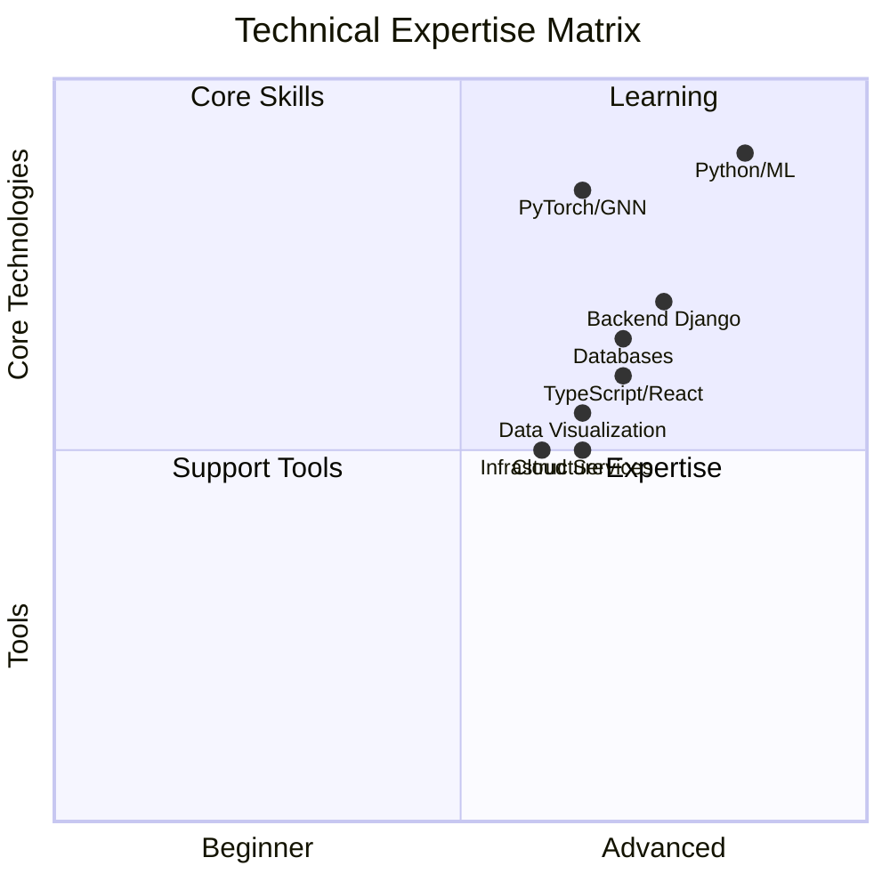

<h1 align="center">
   
  Junha Park (Gregory)
   
  

    

    MLOPS ,Full stack Developer
    

  

</h1>

## 🧑‍💻 About Me

> Passionate Full Stack Developer based in South Korea, specializing in Graph Neural Networks and Economic Research. Currently working at Metalogos APP DEV Team, focusing on innovative product development and machine learning solutions.

  

<!--
## 🚀 Featured Projects

🚀 Featured Projects

<table>
<tr>
  <th>Project Name</th>
  <th>Technologies</th>
  <th>Links</th>
</tr>
<tr>
  <td>
    <h3>Financial Market Analysis</h3>
    
Advanced market pattern recognition system using GNN architecture for real-time financial data analysis

  </td>
  <td>
    
    
    
    
    
  </td>
  <td>
    
    
  </td>
</tr>
<tr>
  <td>
    <h3>Mobile Trading Application</h3>
    
Cross-platform trading solution with real-time market data integration and secure transaction processing

  </td>
  <td>
    
    
    
    
  </td>
  <td>
    
    
  </td>
</tr>
<tr>
  <td>
    <h3>Economic Research Platform</h3>
    
Collaborative research environment with integrated machine learning capabilities for economic analysis

  </td>
  <td>
    
    
    
    
  </td>
  <td>
    
    
  </td>
</tr>
</table>
-->

## 🛠️ Technical Skills

### 🧠 Machine Learning & GNN

### 💻 Full Stack Development
#### Frontend

#### Backend

#### Database

### ☁️ Cloud & Infrastructure

## 📊 Skills Matrix

## 📈 GitHub Stats

## 🤝 Connect & Support

> Open to collaboration on ML & FinTech projects. Reach out for professional inquiries or innovative tech solutions.

