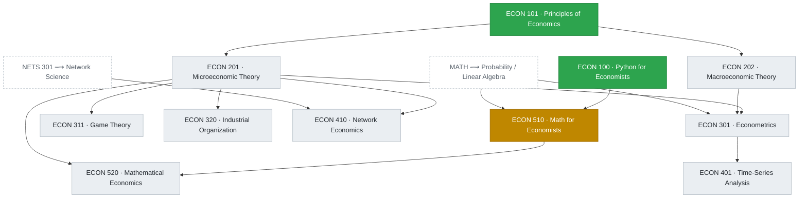
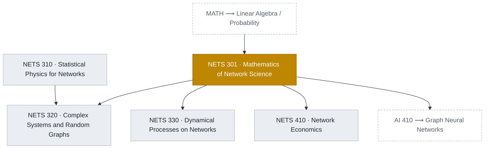
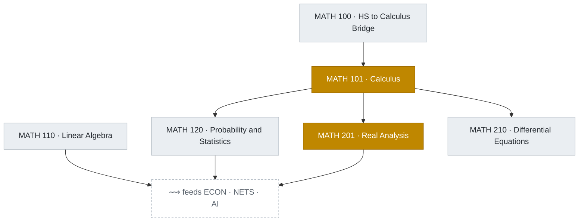
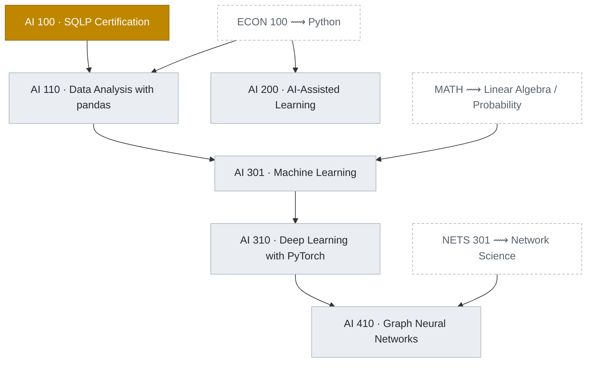

  

  <h2>Junha Park · 박준하</h2>
  

    Economics · Network Science · Mathematics · Artificial Intelligence 
    Hanyang University · 한양대학교
  

  

    
    
    
    
  

 

An open archive of course materials I write as I study, arranged like a university course catalog. Four departments — **Economics**, **Physics · Network Science**, **Mathematics**, and **Artificial Intelligence** — each have their own tech tree of prerequisites and their own catalog that separates what is published, in progress, and planned. Finished courses are published as web books you can read in the browser.

공부하며 만드는 강의 자료의 공개 아카이브를, 대학 수강편람처럼 정리했습니다. **경제학 · 물리학(네트워크 과학) · 수학 · 인공지능** 네 학과가 각자 선수과목 테크트리와, 게시됨·제작 중·예정을 구분한 카탈로그를 갖습니다. 완성된 강의는 웹 교재로 게시되어 바로 읽을 수 있습니다.

**Legend · 범례** &nbsp; 🟩 Published · 게시됨 &nbsp;|&nbsp; 🟨 In progress · 제작 중 &nbsp;|&nbsp; ⬜ Planned · 예정(TBD) &nbsp;|&nbsp; ⟿ dashed node = prerequisite from another department · 타 학과 선수과목

**Departments · 학과** &nbsp; [🟦 Economics](#econ) &nbsp;·&nbsp; [🟪 Physics · Network Science](#nets) &nbsp;·&nbsp; [🟩 Mathematics](#math) &nbsp;·&nbsp; [🟧 Artificial Intelligence](#ai)

---

## 🟦 Economics · 경제학

> From principles to computational and network economics. · 원론에서 계산·네트워크 경제학까지.

```mermaid
graph TD
  classDef done fill:#2da44e,stroke:#1a7f37,color:#ffffff;
  classDef wip  fill:#bf8700,stroke:#9a6700,color:#ffffff;
  classDef todo fill:#eaeef2,stroke:#afb8c1,color:#24292f;
  classDef ext  fill:#ffffff,stroke:#afb8c1,stroke-dasharray:4 3,color:#57606a;

  C100["ECON 100 · Python for Economists"]:::done
  C101["ECON 101 · Principles of Economics"]:::done
  C201["ECON 201 · Microeconomic Theory"]:::todo
  C202["ECON 202 · Macroeconomic Theory"]:::todo
  C301["ECON 301 · Econometrics"]:::todo
  C311["ECON 311 · Game Theory"]:::todo
  C320["ECON 320 · Industrial Organization"]:::todo
  C401["ECON 401 · Time-Series Analysis"]:::todo
  C410["ECON 410 · Network Economics"]:::todo
  C510["ECON 510 · Math for Economists"]:::wip
  C520["ECON 520 · Mathematical Economics"]:::todo
  Xm1["MATH ⟿ Probability / Linear Algebra"]:::ext
  Xn1["NETS 301 ⟿ Network Science"]:::ext

  C101 --> C201
  C101 --> C202
  C201 --> C311
  C201 --> C320
  C201 --> C301
  C202 --> C301
  Xm1 --> C301
  C301 --> C401
  C100 --> C510
  Xm1 --> C510
  C510 --> C520
  C201 --> C520
  C201 --> C410
  Xn1 --> C410
```

<table>
  <tr><th align="left">Code</th><th align="left">Course · 강의</th><th align="left">Prereq · 선수</th></tr>
  <tr><td colspan="3">🟩 &nbsp;<b>Published · 게시됨</b></td></tr>
  <tr><td><code>ECON 100</code></td><td><a href="https://voidmain443.github.io/ECONO_000/">Python for Economists</a> · 경제학도를 위한 파이썬</td><td>—</td></tr>
  <tr><td><code>ECON 101</code></td><td><a href="https://voidmain443.github.io/jbeconsample/">Principles of Economics</a> · 경제학원론</td><td>—</td></tr>
  <tr><td colspan="3">🟨 &nbsp;<b>In progress · 제작 중</b></td></tr>
  <tr><td><code>ECON 510</code></td><td>Math for Economists · 경제수학(대학원 준비)</td><td>ECON 100 · MATH</td></tr>
  <tr><td colspan="3">⬜ &nbsp;<b>Planned · 예정 (TBD)</b></td></tr>
  <tr><td><code>ECON 201</code></td><td>Microeconomic Theory · 미시경제이론</td><td>ECON 101</td></tr>
  <tr><td><code>ECON 202</code></td><td>Macroeconomic Theory · 거시경제이론</td><td>ECON 101</td></tr>
  <tr><td><code>ECON 301</code></td><td>Econometrics · 계량경제학</td><td>ECON 201/202 · MATH 120</td></tr>
  <tr><td><code>ECON 311</code></td><td>Game Theory · 게임이론</td><td>ECON 201</td></tr>
  <tr><td><code>ECON 320</code></td><td>Industrial Organization · 산업조직론</td><td>ECON 201</td></tr>
  <tr><td><code>ECON 401</code></td><td>Time-Series Analysis · 시계열분석</td><td>ECON 301</td></tr>
  <tr><td><code>ECON 410</code></td><td>Network Economics · 네트워크경제학</td><td>ECON 201 · NETS 301</td></tr>
  <tr><td><code>ECON 520</code></td><td>Mathematical Economics · 수리경제학</td><td>ECON 510</td></tr>
</table>

---

## 🟪 Physics · Network Science · 물리학(네트워크 과학)

> The statistical physics and mathematics of networks — my bridge from economics toward AI. · 네트워크의 통계물리와 수학, 경제학에서 AI로 가는 다리.

```mermaid
graph TD
  classDef done fill:#2da44e,stroke:#1a7f37,color:#ffffff;
  classDef wip  fill:#bf8700,stroke:#9a6700,color:#ffffff;
  classDef todo fill:#eaeef2,stroke:#afb8c1,color:#24292f;
  classDef ext  fill:#ffffff,stroke:#afb8c1,stroke-dasharray:4 3,color:#57606a;

  N301["NETS 301 · Mathematics of Network Science"]:::wip
  N310["NETS 310 · Statistical Physics for Networks"]:::todo
  N320["NETS 320 · Complex Systems and Random Graphs"]:::todo
  N330["NETS 330 · Dynamical Processes on Networks"]:::todo
  N410["NETS 410 · Network Economics"]:::todo
  Xm2["MATH ⟿ Linear Algebra / Probability"]:::ext
  Xa2["AI 410 ⟿ Graph Neural Networks"]:::ext

  Xm2 --> N301
  N310 --> N320
  N301 --> N320
  N301 --> N330
  N301 --> N410
  N301 --> Xa2
```

<table>
  <tr><th align="left">Code</th><th align="left">Course · 강의</th><th align="left">Prereq · 선수</th></tr>
  <tr><td colspan="3">🟨 &nbsp;<b>In progress · 제작 중</b></td></tr>
  <tr><td><code>NETS 301</code></td><td>Mathematics of Network Science · 네트워크 과학의 수학 (64p textbook)</td><td>MATH 110 · MATH 120</td></tr>
  <tr><td colspan="3">⬜ &nbsp;<b>Planned · 예정 (TBD)</b></td></tr>
  <tr><td><code>NETS 310</code></td><td>Statistical Physics for Networks · 네트워크 통계물리</td><td>MATH 120</td></tr>
  <tr><td><code>NETS 320</code></td><td>Complex Systems and Random Graphs · 복잡계와 랜덤그래프</td><td>NETS 301 · NETS 310</td></tr>
  <tr><td><code>NETS 330</code></td><td>Dynamical Processes on Networks · 네트워크 동역학 (epidemics, percolation)</td><td>NETS 301</td></tr>
  <tr><td><code>NETS 410</code></td><td>Network Economics · 네트워크경제학 (cross-listed ECON 410)</td><td>NETS 301 · ECON 201</td></tr>
</table>

---

## 🟩 Mathematics · 수학

> The proof-level foundation that everything else stands on. · 다른 모든 것이 딛고 서는 증명 수준의 기초.

```mermaid
graph TD
  classDef done fill:#2da44e,stroke:#1a7f37,color:#ffffff;
  classDef wip  fill:#bf8700,stroke:#9a6700,color:#ffffff;
  classDef todo fill:#eaeef2,stroke:#afb8c1,color:#24292f;
  classDef ext  fill:#ffffff,stroke:#afb8c1,stroke-dasharray:4 3,color:#57606a;

  M100["MATH 100 · HS to Calculus Bridge"]:::todo
  M101["MATH 101 · Calculus"]:::wip
  M201["MATH 201 · Real Analysis"]:::wip
  M110["MATH 110 · Linear Algebra"]:::todo
  M120["MATH 120 · Probability and Statistics"]:::todo
  M210["MATH 210 · Differential Equations"]:::todo
  Xout["⟿ feeds ECON · NETS · AI"]:::ext

  M100 --> M101
  M101 --> M201
  M101 --> M210
  M101 --> M120
  M110 --> Xout
  M120 --> Xout
  M201 --> Xout
```

<table>
  <tr><th align="left">Code</th><th align="left">Course · 강의</th><th align="left">Prereq · 선수</th></tr>
  <tr><td colspan="3">🟨 &nbsp;<b>In progress · 제작 중</b></td></tr>
  <tr><td><code>MATH 101</code></td><td>Calculus · 미적분학 (14-week, SymPy-verified)</td><td>MATH 100</td></tr>
  <tr><td><code>MATH 201</code></td><td>Real Analysis · 해석학 (completeness to Taylor to Euler)</td><td>MATH 101</td></tr>
  <tr><td colspan="3">⬜ &nbsp;<b>Planned · 예정 (TBD)</b></td></tr>
  <tr><td><code>MATH 100</code></td><td>HS to Calculus Bridge · 고교수학 가교</td><td>—</td></tr>
  <tr><td><code>MATH 110</code></td><td>Linear Algebra · 선형대수학</td><td>—</td></tr>
  <tr><td><code>MATH 120</code></td><td>Probability and Statistics · 확률통계</td><td>MATH 101</td></tr>
  <tr><td><code>MATH 210</code></td><td>Differential Equations · 미분방정식</td><td>MATH 101</td></tr>
</table>

---

## 🟧 Artificial Intelligence · 인공지능

> Data foundations up to graph neural networks, where this all converges. · 데이터 기초에서 그래프 신경망까지, 모든 갈래가 모이는 곳.

```mermaid
graph TD
  classDef done fill:#2da44e,stroke:#1a7f37,color:#ffffff;
  classDef wip  fill:#bf8700,stroke:#9a6700,color:#ffffff;
  classDef todo fill:#eaeef2,stroke:#afb8c1,color:#24292f;
  classDef ext  fill:#ffffff,stroke:#afb8c1,stroke-dasharray:4 3,color:#57606a;

  D100["AI 100 · SQLP Certification"]:::wip
  D110["AI 110 · Data Analysis with pandas"]:::todo
  A200["AI 200 · AI-Assisted Learning"]:::todo
  A301["AI 301 · Machine Learning"]:::todo
  A310["AI 310 · Deep Learning with PyTorch"]:::todo
  A410["AI 410 · Graph Neural Networks"]:::todo
  Xpy["ECON 100 ⟿ Python"]:::ext
  Xm3["MATH ⟿ Linear Algebra / Probability"]:::ext
  Xn3["NETS 301 ⟿ Network Science"]:::ext

  Xpy --> D110
  D100 --> D110
  Xpy --> A200
  D110 --> A301
  Xm3 --> A301
  A301 --> A310
  A310 --> A410
  Xn3 --> A410
```

<table>
  <tr><th align="left">Code</th><th align="left">Course · 강의</th><th align="left">Prereq · 선수</th></tr>
  <tr><td colspan="3">🟨 &nbsp;<b>In progress · 제작 중</b></td></tr>
  <tr><td><code>AI 100</code></td><td>SQLP Certification · SQL 전문가(SQLP) (textbook + 1,000-item bank)</td><td>—</td></tr>
  <tr><td colspan="3">⬜ &nbsp;<b>Planned · 예정 (TBD)</b></td></tr>
  <tr><td><code>AI 110</code></td><td>Data Analysis with pandas · 판다스 데이터 분석</td><td>AI 100 · ECON 100</td></tr>
  <tr><td><code>AI 200</code></td><td>AI-Assisted Learning · AI 활용 학습법 (verification-first)</td><td>ECON 100</td></tr>
  <tr><td><code>AI 301</code></td><td>Machine Learning · 머신러닝</td><td>AI 110 · MATH 110/120</td></tr>
  <tr><td><code>AI 310</code></td><td>Deep Learning with PyTorch · 딥러닝(PyTorch)</td><td>AI 301</td></tr>
  <tr><td><code>AI 410</code></td><td>Graph Neural Networks · 그래프 신경망 (cross-listed NETS)</td><td>AI 310 · NETS 301</td></tr>
</table>

---

<b>Built with</b> · Quarto, Jupyter Book, and MyST, published on GitHub Pages. Code and proofs are checked with Python (SymPy, NumPy, NetworkX, pandas) and typeset in LaTeX. · Quarto·Jupyter Book·MyST로 작성하고 GitHub Pages에 게시. 코드·증명은 Python으로 검증, 수식은 LaTeX.

 

Open to collaboration on network analysis, computational economics, and related work — <a href="mailto:voidmain443@gmail.com">voidmain443@gmail.com</a>. · 네트워크 분석·계산경제학 협업 환영.
