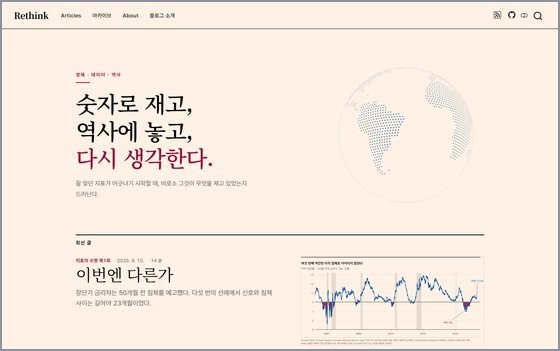
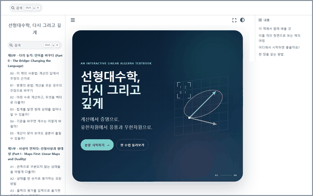
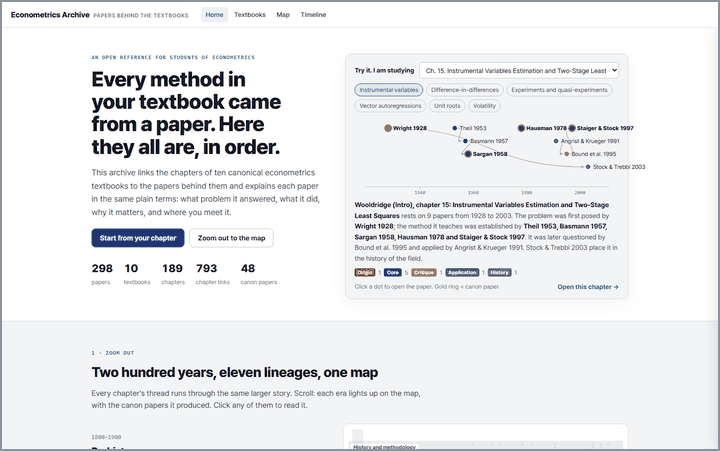
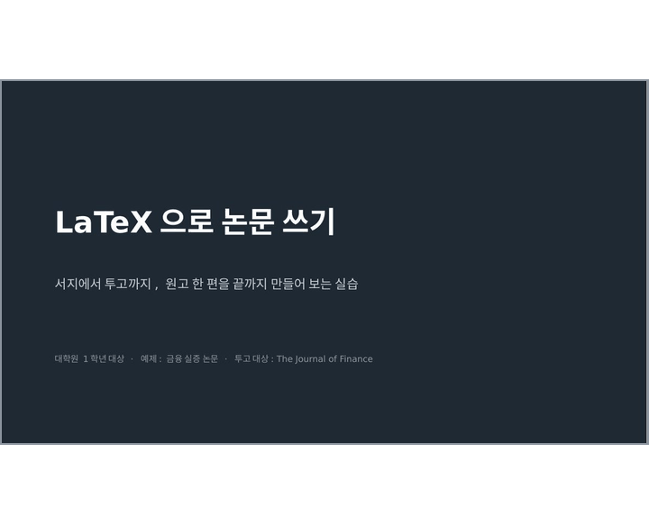
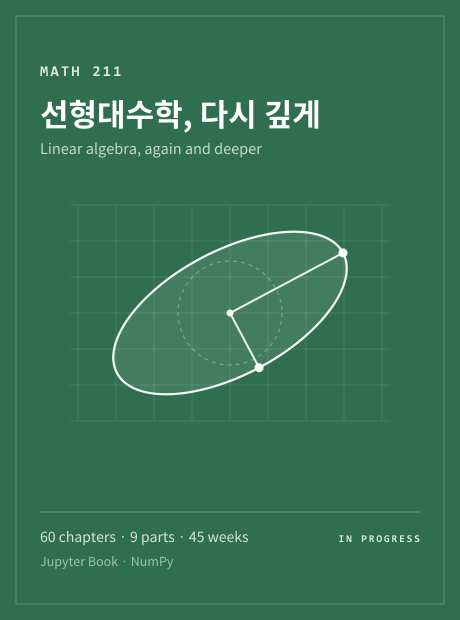
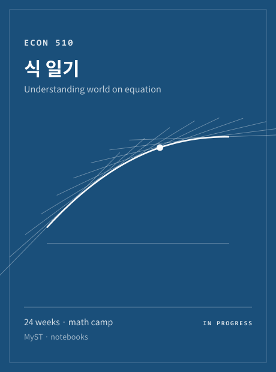
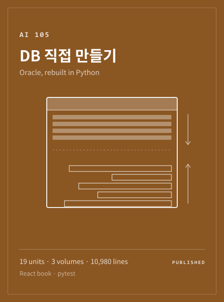

  
  <h2>Junha Park · 박준하</h2>
  

    
    
    
  

<table align="center">
<tr>
<td width="280"></td>
<td valign="middle">
<b><a href="https://voidmain443.github.io/github_blog_engine/">Rethink</a></b> — 숫자로 재고, 역사에 놓고, 다시 생각한다. 
경제학과 세상을 잇는 글을 써 보는 시도입니다. 현안을 데이터로 읽고, 역사와 경제학의 눈으로 다시 생각해 봅니다.
</td>
</tr>
</table>

<a href="#projects">Projects · 프로젝트</a> &nbsp;·&nbsp; <a href="#books">Textbooks · 교재</a> &nbsp;·&nbsp; <a href="#archives">Archives · 아카이브</a> &nbsp;·&nbsp; <a href="#contact">Contact · 연락</a>

Learning and DEV journey, 공부할 교재들과 부족했던 부분들을 과외하면서 일부만 빼서 경제학공부에 도움이 될 만한 부분들을 정리한 깃허브입니다. 다른 백앤드와 APP개발등등을 해오면서 필요했고 좀더 깊게 이해한 내용들의 일부만 이곳에 아카이빙합니다.

경제학을 공부하면서 궁금했던 식, 세상, 모델링 등을 계량경제학과 생산자 추정 모형등에 관심이 많았고, 세상을 일반적인 사회과학보다는 자연법칙 내에서의 제약으로 다루고싶습니다. 일반적인 사회과학내의 경제학이 아닌 게임이론 속에서 인간의 선택이 더 나은 공간이길 바라며 자유시장이 좀더 오래지속하길 바라는 마음으로 공부를 지속합니다.

수학에서의 "공간"의 개념을 좋아하고, 물리학에서 "측정"과 "측도"로 경제적 질문에 대답하고 논의하는 걸 좋아합니다. 다학제적 관점에서 접근하고 바라보는것이 현재의 "탐험"입니다.

-장막속에서 길을 그리며-

커피챗 좋아합니다. 위의 프로필 링크로 연락주시면 공동연구 및 업무등에 있어서 논의하면 재미있을 것 같습니다.

생성물 일부 · some of the things built

## Projects · 프로젝트

사람들에게 도움될 만한 자료를 만들어보고 있습니다. 참고하시면 좋겠습니다.

<table>
<tr>
<td width="50%" valign="top">
<h4><a href="https://voidmain443.github.io/econometrics-map/">Econometrics Archive</a> 교과서 뒤의 논문들</h4>

교과서의 모든 방법은 논문에서 왔다. 10권 · 189장을 그 뒤의 논문 298편과 793개 링크로 잇고, 11개 계보 띠 위에 200년의 지도로 그렸다. 정본 논문 48편은 금테.

<a href="https://voidmain443.github.io/econometrics-map/map.html">지도</a> · <a href="https://voidmain443.github.io/econometrics-map/timeline.html">타임라인</a> · <a href="https://voidmain443.github.io/econometrics-map/textbooks.html">교과서에서 시작</a>   
</td>
<td width="50%" valign="top">
<h4><a href="https://github.com/voidmain443/overleaf_study_guide">Overleaf와 LaTeX으로 경제학 논문 쓰기</a> 서지에서 투고까지</h4>

빈 파일에서 투고 패키지까지, 학술지 서식으로 조판된 22쪽 논문 한 편을 끝까지 만든다. 교안 39쪽 · 슬라이드 116장 · 시작 프로젝트 · 완성 원고 · 장별 스냅샷 12개.

<a href="https://github.com/voidmain443/overleaf_study_guide">저장소</a> · <a href="https://github.com/voidmain443/overleaf_study_guide/blob/main/guide/latex-paper-guide.pdf">교안 PDF</a> · <a href="https://github.com/voidmain443/overleaf_study_guide/tree/main/starter">시작 프로젝트</a>   
</td>
</tr>
</table>

<h4>Smaller tools · 작은 도구들</h4>

-  — SQLP 실습용 이커머스 데이터셋 생성기. HR 실습 이후에 쓰는 규모의 표와 인덱스 실험 데이터.
-  — 국내 타깃데이트펀드의 기준가 · 설정액 · 자금 유출입을 매일 수집하는 멱등 크롤러. 역할별 문서와 팀 학습 트랙.
-  — 비개발 팀을 Git 과 프로젝트 도구 위에 세우는 튜토리얼. PMI 스터디 그룹 교재로 제작 중.

## Textbooks · 교재

네 학과로 나누어 씁니다. 지도가 먼저, 그다음 학과별로. 완성되는 순서대로 카드가 늘어나고, 예정된 권은 지도와 접힌 목록에 있습니다.

  <picture>
    <source media="(prefers-color-scheme: dark)" srcset="img/curriculum-dark.svg">
    
  </picture>

● published 게시됨 &nbsp; ◐ in progress 제작 중 &nbsp; ○ planned 예정 &nbsp;&nbsp;|&nbsp;&nbsp; 왼쪽에서 오른쪽이 선수 관계, 점선은 학과를 건너는 선수과목

> **원고가 필요하신가요?** 교재의 원고 저장소(노트북 · LaTeX · 그림 코드)는 비공개입니다. 강의나 스터디에 쓰고 싶으시면  으로 연락 주세요. 저장소에 협업자로 초대해 드립니다. 사이트는 누구나 읽을 수 있습니다.

<h3> &nbsp;수학 증명 수준의 기초. 나머지 셋이 그 위에 선다.</h3>

    

- **[수학 재건 · Foundations before Calculus](https://voidmain443.github.io/pre_math_lecture_jupyter/intro.html)** — arithmetic, algebra and single-variable calculus rebuilt out of a 36-week study group; every chapter carries the errors people actually made. `MATH 100` · 43 chapters · 4 parts · ●
- **[차근히 시작하는 증명법 · Where Proof Begins](https://voidmain443.github.io/pre_book_of_proof/intro.html)** — logic, sets, induction and the standard strategies, worked slowly enough that a first proof course stops being a wall: Hammack, then Solow, then Chartrand. `MATH 150` · 90 weeks · 3 stages · ●
- **[미적분학 79회 · Calculus, after Apostol](https://voidmain443.github.io/Calculus_apostol_jupyterbook/intro.html)** — integration before differentiation, aimed the whole way at ∫Ω dω = ∫∂Ω ω. `MATH 101` · 79 sessions · 6 parts · ◐
- **[선형대수 — 서술과 파이썬 구현 · Linear Algebra, 18.06 rebuilt](https://voidmain443.github.io/linear_algebra_gilbert/)** — each lecture split into a written argument and a NumPy notebook, with a fixed colour convention for domain, codomain, error and subspace. `MATH 110` · 34 lectures · 9 acts · ●
- **[선형대수학, 다시 그리고 깊게 · Linear Algebra, Again and Deeper](https://voidmain443.github.io/linear_algebra_foundation_book/)** — the sequel to 18.06: matrices demoted to coordinate representations, a numerical footnote on every theory chapter, econometrics recovered as projection in Part VI. `MATH 211` · 60 chapters · 9 parts · 45 weeks · ◐

전체 계획 · planned volumes in MATH
 MATH 120 확률통계 · MATH 201 해석학 (◐) · MATH 210 미분방정식 · MATH 220 다변수해석 · MATH 230 이산·조합론 · MATH 240 수치해석 · MATH 260 최적화 · MATH 301 측도·확률론 · MATH 310 확률과정 · MATH 320 함수해석 · MATH 330 통계적 추론

<h3> &nbsp;경제학 원론에서 계산경제학과 네트워크경제학까지.</h3>

  

- **[경제학과 1학년을 위한 파이썬 (2판) · Python for Economists](https://voidmain443.github.io/ECONO_000/)** — from variables and loops to supply-and-demand models in Matplotlib; second edition rewritten from a semester of student feedback. `ECON 100` · 8 weeks · 11 chapters · ●
- **[경제학원론 · Principles of Economics](https://voidmain443.github.io/economic_principle_book/)** — taught against open data (Maddison, World Bank, OWID, Penn World Table) instead of drawn diagrams. `ECON 101` · 15 chapters · 4 parts · ●
- **[식 일기 · Understanding World on Equation](https://voidmain443.github.io/Equation_diary/)** — a math camp on reading, not solving: what each symbol names, which assumption each line leans on, where undergraduate and graduate readings part ways. `ECON 510` · 24 weeks · 3 parts · ◐

전체 계획 · planned volumes in ECON
 ECON 201 미시 · ECON 202 거시 · ECON 301 계량 · ECON 311 게임이론 · ECON 320 산업조직 · ECON 401 시계열 · ECON 520 수리경제 · ECON 601/602 미시·거시이론 · ECON 610 계량이론 · ECON 620 계산경제학 · ECON 630 금융경제학

<h3> &nbsp;네트워크 과학 네트워크의 통계물리와 수학. 제 연구가 있는 자리.</h3>

- **네트워크 과학의 수학 · Mathematics of Network Science** — the bridge from economics toward AI; graphs, measures, random graphs and the statistical physics behind them. `NETS 301` · 64-page manuscript · ◐

전체 계획 · planned volumes in NETS
 NETS 201 네트워크 기초 · NETS 310 통계물리 · NETS 320 랜덤그래프 · NETS 330 네트워크 동역학 · NETS 410 네트워크경제학 · NETS 510 복잡계 · NETS 520 경제물리학 · NETS 530 네트워크 추론

<h3> &nbsp;인공지능 데이터 기초에서 그래프 신경망까지. 넷이 모이는 곳.</h3>

- **[Oracle 을 파이썬으로 처음부터 만들며 이해하기 · Build a Database](https://voidmain443.github.io/building_database/)** — a learner who only knows <code>SELECT</code> builds Oracle's storage and instance structure one line at a time, up to crash recovery and row locks. `AI 105` · 19 units · 3 volumes · 10,980 lines · ●
- **SQLP 합격에서 Hero까지 · SQL deepdive** — exam preparation, then the principles behind execution plans, then a performance lab on Oracle 23ai. `AI 100` · 8 weeks · 1,100+ items · 12 lectures · ◐
- **ADP 실습 교재 · Data Analysis with pandas** — read, analyse and report: access audits, ledger reconciliation, checkout funnels, return distributions, delivery sampling. `AI 110` · 5 projects · 69 notebooks · 105 problems · ◐
- **[8주 생성형 AI 집중 과정 · Generative AI, local edition](https://github.com/voidmain443/8week_AI_with_GeminiAPI)** — Google × Kaggle's intensives redesigned as eight Thursday sessions: prompting, embeddings, RAG, function calling, agents, fine-tuning, MLOps. `AI 200` · 8 weeks · Gemini API · ●

전체 계획 · planned volumes in AI
 AI 301 머신러닝 · AI 310 딥러닝 · AI 410 그래프 신경망 · AI 501 통계적 학습이론 · AI 520 강화학습 · AI 530 인과추론

## Archives & reading lists · 아카이브

교재도 프로젝트도 아닌 것. 읽을 목록과 보관 자료.

-  — an annotated map of academic economics: what to read for each field, in what order, and what each book is bad at. Micro from Varian to MWG and where Kreps patches it; econometrics split between estimator theory and design-based causal inference. 학술 경제학 자료를 "왜 이 자료인가"와 함께 정리한 목록
-  — PSID, NLSY, HRS, SIPP and Add Health each written up in full, mapped onto their Korean counterparts (KLIPS, KOWEPS, KLoSA, 가계금융복지조사). 미시 패널 데이터 접근 경로와 설계 철학
-  — <a href="https://github.com/voidmain443/awesome-economic/blob/main/01.Methodenstreit.md">Methodenstreit</a> · <a href="https://github.com/voidmain443/awesome-economic/blob/main/02.Socialist_Calculation_Debate.md">Socialist Calculation</a> · <a href="https://github.com/voidmain443/awesome-economic/blob/main/03.Keynes_vs_Hayek.md">Keynes vs Hayek</a> · <a href="https://github.com/voidmain443/awesome-economic/blob/main/04.Cambridge%20Capital%20Controversy.md">Cambridge Capital Controversy</a> · <a href="https://github.com/voidmain443/awesome-economic/blob/main/05.Friedman_LUcas.md">Friedman and Lucas</a> · <a href="https://github.com/voidmain443/awesome-economic/blob/main/06.Stimulus_and_Austerity.md">Stimulus and Austerity</a> · <a href="https://github.com/voidmain443/awesome-economic/blob/main/07.Mark_Blaug.md">Mark Blaug</a>
-  — statistics with Python for social science majors, 2023. 학습자료 제작 중단 · 보관용

## Contact · 연락

Open to collaboration on network analysis and computational economics — [voidmain443@gmail.com](mailto:voidmain443@gmail.com). 교재 원고 저장소 초대 요청도 같은 주소로.

네트워크 분석·계산경제학 협업 환영. 비공개로 제작 중인 원고(학부연구생 데이터분석 과정, Mini-Bloomberg Python, 증명법 LaTeX 판, KIS)는 협업 문의로 열어 드립니다.
