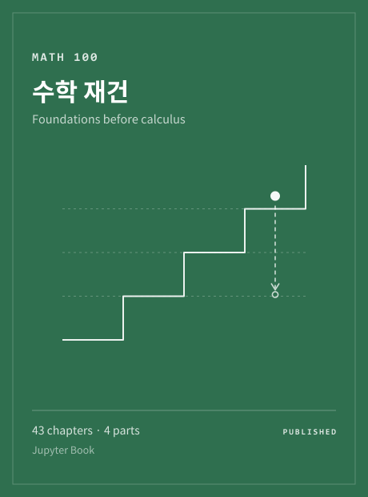
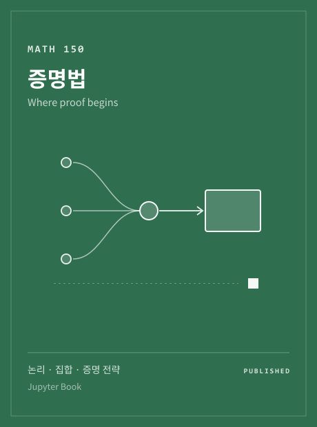
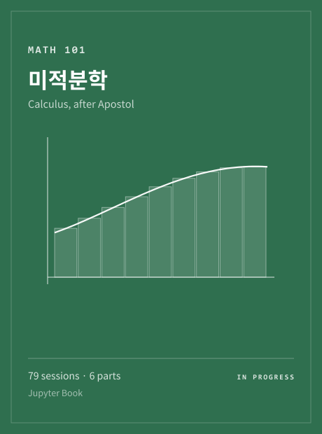
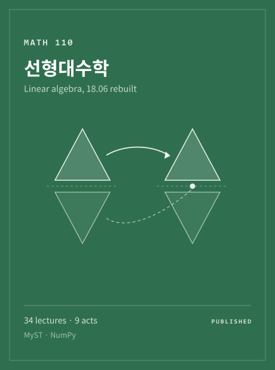
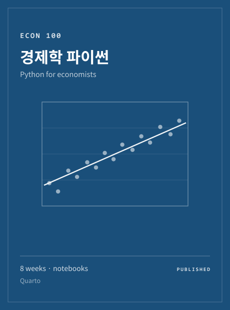
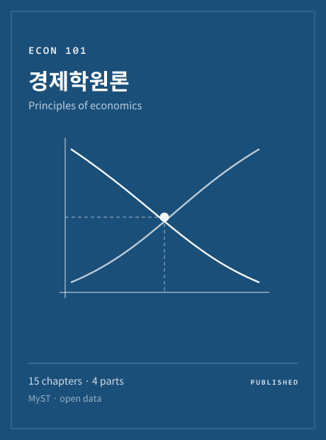
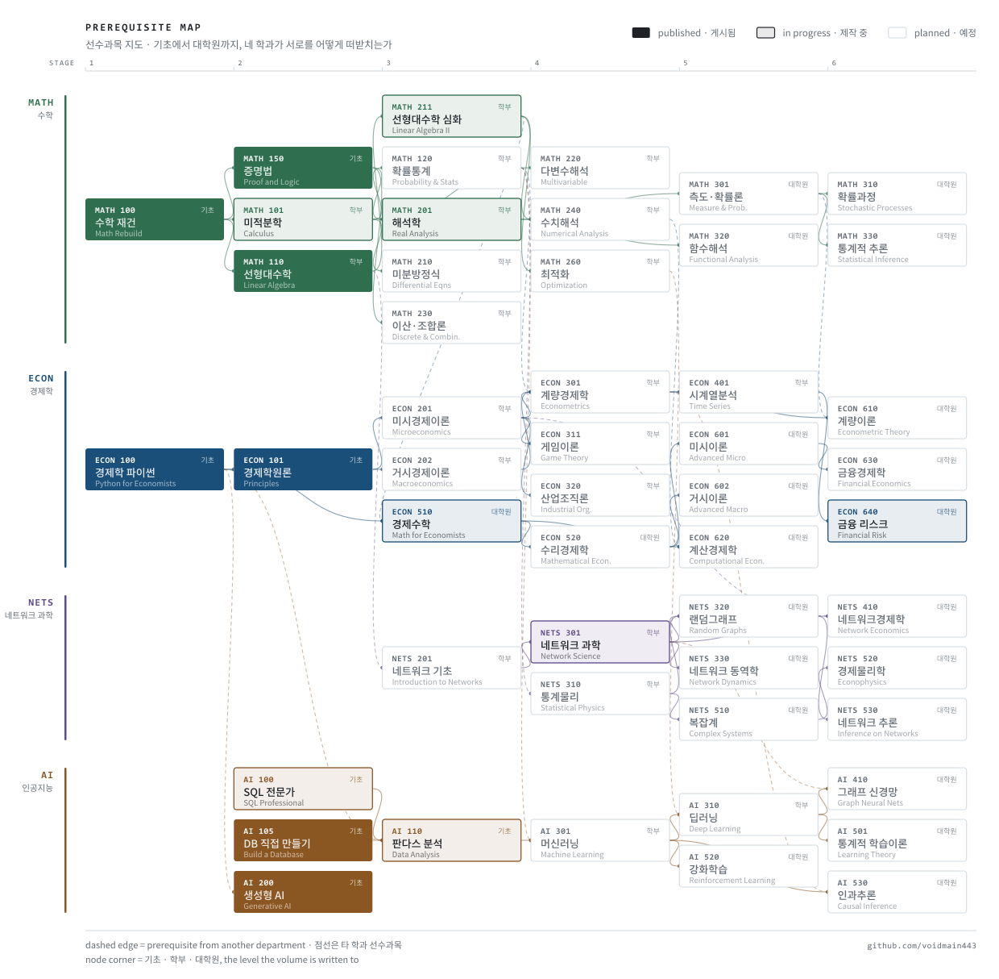

  

<pre align="center"><b>Junha Park · 박준하 /</b> <a href="#books">Books</a> / <a href="https://github.com/voidmain443/awesome-economic">Archive</a> / <a href="https://www.linkedin.com/in/junha-park-592630193/">LinkedIn</a> / <a href="https://x.com/voidmain443">X</a> / <a href="mailto:voidmain443@gmail.com">Mail</a></pre>

Learning and DEV journey, 공부할 교재들과 부족했던 부분들을 과외하면서 일부만 빼서 경제학공부에 도움이 될 만한 부분들을 정리한 깃허브입니다. 다른 백앤드와 APP개발등등을 해오면서 필요했고 좀더 깊게 이해한 내용들의 일부만 이곳에 아카이빙합니다. 
  
경제학을 공부하면서 궁금했던 식, 세상, 모델링 등을 계량경제학과 생산자 추정 모형등에 관심이 많았고, 세상을 일반적인 사회과학보다는 자연법칙 내에서의 제약으로 다루고싶습니다. 일반적인 사회과학내의 경제학이 아닌 게임이론 속에서 인간의 선택이 더 나은 공간이길 바라며 자유시장이 좀더 오래지속하길 바라는 마음으로 공부를 지속합니다. 
  
수학에서의 "공간"의 개념을 좋아하고, 물리학에서 "측정"과 "측도"로 경제적 질문에 대답하고 논의하는 걸 좋아합니다. 다학제적 관점에서 접근하고 바라보는것이 현재의 "탐험"입니다.

-장막속에서 길을 그리며-

커피챗 좋아합니다. 위의 프로필 링크로 연락주시면 공동연구 및 업무등에 있어서 논의하면 재미있을 것 같습니다.

 

## Published 

- **[수학 재건 · Foundations before Calculus](https://voidmain443.github.io/pre_math_lecture_jupyter/intro.html)** — arithmetic, algebra, single-variable calculus and applications in 43 chapters, written out of a 36-week study group. Every chapter carries the errors people actually made. `MATH 100` · 대학 입학 전 수학을 다시 세우는 43장
- **[증명법 · Where Proof Begins](https://voidmain443.github.io/pre_book_of_proof/intro.html)** — logic, sets, induction and the standard proof strategies, worked slowly enough that a first proof course stops being a wall. This is the book that makes MATH 201 and everything above it possible. `MATH 150` · 논리·집합·증명 전략을 처음부터
- **[선형대수학 · Linear Algebra](https://voidmain443.github.io/linear_algebra_gilbert/)** — Strang's 18.06 rebuilt as 34 lectures in 9 acts, each split into a written argument and a NumPy notebook, with a fixed colour convention for domain, codomain, error and subspace. `MATH 110` · 서술과 파이썬 구현의 이중 구성
- **[경제학 파이썬 · Python for Economists](https://voidmain443.github.io/ECONO_000/)** — eight weeks from variables and loops to supply-and-demand models plotted in Matplotlib; the prerequisite a first-year economics student needs before any of the above. `ECON 100` · 경제학도를 위한 8주 파이썬 입문
- **[경제학원론 · Principles of Economics](https://voidmain443.github.io/economic_principle_book/)** — 15 chapters in 4 parts, taught against open data (Maddison, World Bank, OWID, Penn World Table) instead of drawn diagrams. `ECON 101` · 데이터로 확인하는 원론

## In progress · 제작 중

- **[미적분학 · Calculus, after Apostol](https://voidmain443.github.io/Calculus_apostol_jupyterbook/intro.html)** — 79 sessions in 6 parts, integration before differentiation, aimed the whole way at ∫Ω dω = ∫∂Ω ω. Sources are Apostol Vol. 1–2, Munkres' 18.014 notes and Strang. `MATH 101` · 적분을 먼저 놓고 시작하는 79회
- **해석학 · Real Analysis** — completeness through Taylor to Euler. `MATH 201`
- **경제수학 · Math for Economists** — graduate preparation, built on `ECON 100` and linear algebra. `ECON 510`
- **네트워크 과학의 수학 · Mathematics of Network Science** — a 64-page manuscript; the bridge from economics toward AI. `NETS 301`
- **SQL as Deep dive** — textbook plus a 1,000-item bank, with an [Oracle 26ai dataset generator](https://github.com/voidmain443/oracle_db_tutorial). `AI 100`

## Archives & reading lists · 아카이브

- **[Awesome Economics](https://github.com/voidmain443/awesome-economic)** — an annotated map of academic economics: what to read for each field, in what order, and what each book is bad at. Micro from Varian to MWG and where Kreps patches it; econometrics split between estimator theory and design-based causal inference; computational economics organised by researcher rather than textbook. 학술 경제학 자료를 "왜 이 자료인가"와 함께 정리한 목록
  - **[Databases and panels](https://github.com/voidmain443/awesome-economic/tree/main/database)** — PSID, NLSY, HRS, SIPP and Add Health each written up in full, mapped onto their Korean counterparts (KLIPS, KOWEPS, KLoSA, 가계금융복지조사). 미시 패널 데이터 접근 경로와 설계 철학
  - **Debates in the history of thought** — [Methodenstreit](https://github.com/voidmain443/awesome-economic/blob/main/01.Methodenstreit.md) · [Socialist Calculation](https://github.com/voidmain443/awesome-economic/blob/main/02.Socialist_Calculation_Debate.md) · [Keynes vs Hayek](https://github.com/voidmain443/awesome-economic/blob/main/03.Keynes_vs_Hayek.md) · [Cambridge Capital Controversy](https://github.com/voidmain443/awesome-economic/blob/main/04.Cambridge%20Capital%20Controversy.md) · [Friedman and Lucas](https://github.com/voidmain443/awesome-economic/blob/main/05.Friedman_LUcas.md) · [Stimulus and Austerity](https://github.com/voidmain443/awesome-economic/blob/main/06.Stimulus_and_Austerity.md) · [Mark Blaug](https://github.com/voidmain443/awesome-economic/blob/main/07.Mark_Blaug.md)
- **[사회과학을 위한 파이썬 통계 분석](https://voidmain443.github.io/Reasearch_A/)** — ING.... statistics with Python for social science majors, 2023. 학습자료 제작중 중단 
- **[Git & GitHub for project managers](https://github.com/voidmain443/git-github_for_PM_Tutorial_docs)** — setting a team up on Git alongside the tools they already use. 팀 세팅용 가이드- PMI 스터디 그룹 교재 제작중 

## Curriculum ·  커리큘럼 고민중 

4가지 분야로 여러 공부해왔던걸 나름대로 커리큘럼을 만들어보고 있습니다. 

  <picture>
    <source media="(prefers-color-scheme: dark)" srcset="img/curriculum-dark.svg">
    
  </picture>

Status · 상태 &nbsp; ● published 게시됨 &nbsp; ◐ in progress 제작 중 &nbsp; ○ planned 예정 &nbsp;&nbsp;|&nbsp;&nbsp; Level · 수준 &nbsp; 기초 foundations &nbsp; 학부 undergraduate &nbsp; 대학원 graduate

<b>MATH · 수학</b> — 15 volumes, the proof-level foundation everything else stands on

 

<table>
  <tr><th align="left">Code</th><th align="left">Course · 강의</th><th align="left">Prereq · 선수</th><th align="left">Status</th></tr>
  <tr><td colspan="4"><b>기초 · foundations</b></td></tr>
  <tr><td><code>MATH 100</code></td><td><a href="https://voidmain443.github.io/pre_math_lecture_jupyter/intro.html">Foundations before Calculus</a> · 수학 재건 (43 chapters)</td><td>—</td><td align="center">●</td></tr>
  <tr><td><code>MATH 150</code></td><td><a href="https://voidmain443.github.io/pre_book_of_proof/intro.html">Where Proof Begins</a> · 증명법 (logic, sets, induction)</td><td>MATH 100</td><td align="center">●</td></tr>
  <tr><td colspan="4"><b>학부 · undergraduate</b></td></tr>
  <tr><td><code>MATH 101</code></td><td><a href="https://voidmain443.github.io/Calculus_apostol_jupyterbook/intro.html">Calculus</a> · 미적분학 (79 sessions, after Apostol)</td><td>MATH 100</td><td align="center">◐</td></tr>
  <tr><td><code>MATH 110</code></td><td><a href="https://voidmain443.github.io/linear_algebra_gilbert/">Linear Algebra</a> · 선형대수학 (34 lectures, 18.06 rebuilt)</td><td>MATH 100</td><td align="center">●</td></tr>
  <tr><td><code>MATH 120</code></td><td>Probability and Statistics · 확률통계</td><td>MATH 101</td><td align="center">○</td></tr>
  <tr><td><code>MATH 201</code></td><td>Real Analysis · 해석학 (completeness to Taylor to Euler)</td><td>MATH 150 · MATH 101</td><td align="center">◐</td></tr>
  <tr><td><code>MATH 210</code></td><td>Differential Equations · 미분방정식</td><td>MATH 101</td><td align="center">○</td></tr>
  <tr><td><code>MATH 220</code></td><td>Multivariable Analysis · 다변수해석 (vector calculus to Stokes)</td><td>MATH 101 · MATH 110</td><td align="center">○</td></tr>
  <tr><td><code>MATH 230</code></td><td>Discrete Mathematics and Combinatorics · 이산·조합론</td><td>MATH 150</td><td align="center">○</td></tr>
  <tr><td><code>MATH 240</code></td><td>Numerical Analysis · 수치해석 (the arithmetic every simulation rests on)</td><td>MATH 110 · MATH 210</td><td align="center">○</td></tr>
  <tr><td><code>MATH 260</code></td><td>Optimization · 최적화 (convexity, duality, gradient methods)</td><td>MATH 110 · MATH 220</td><td align="center">○</td></tr>
  <tr><td colspan="4"><b>대학원 · graduate</b></td></tr>
  <tr><td><code>MATH 301</code></td><td>Measure and Probability · 측도·확률론</td><td>MATH 201</td><td align="center">○</td></tr>
  <tr><td><code>MATH 310</code></td><td>Stochastic Processes · 확률과정 (martingales, Markov, Itô)</td><td>MATH 301</td><td align="center">○</td></tr>
  <tr><td><code>MATH 320</code></td><td>Functional Analysis · 함수해석</td><td>MATH 201 · MATH 110</td><td align="center">○</td></tr>
  <tr><td><code>MATH 330</code></td><td>Statistical Inference · 통계적 추론 (mathematical statistics)</td><td>MATH 301 · MATH 120</td><td align="center">○</td></tr>
</table>

<b>ECON · 경제학</b> — 15 volumes, from principles to computational and network economics

 

<table>
  <tr><th align="left">Code</th><th align="left">Course · 강의</th><th align="left">Prereq · 선수</th><th align="left">Status</th></tr>
  <tr><td colspan="4"><b>기초 · foundations</b></td></tr>
  <tr><td><code>ECON 100</code></td><td><a href="https://voidmain443.github.io/ECONO_000/">Python for Economists</a> · 경제학 파이썬</td><td>—</td><td align="center">●</td></tr>
  <tr><td><code>ECON 101</code></td><td><a href="https://voidmain443.github.io/economic_principle_book/">Principles of Economics</a> · 경제학원론 (15 chapters)</td><td>ECON 100</td><td align="center">●</td></tr>
  <tr><td colspan="4"><b>학부 · undergraduate</b></td></tr>
  <tr><td><code>ECON 201</code></td><td>Microeconomic Theory · 미시경제이론</td><td>ECON 101</td><td align="center">○</td></tr>
  <tr><td><code>ECON 202</code></td><td>Macroeconomic Theory · 거시경제이론</td><td>ECON 101</td><td align="center">○</td></tr>
  <tr><td><code>ECON 301</code></td><td>Econometrics · 계량경제학</td><td>ECON 201/202 · MATH 120</td><td align="center">○</td></tr>
  <tr><td><code>ECON 311</code></td><td>Game Theory · 게임이론</td><td>ECON 201</td><td align="center">○</td></tr>
  <tr><td><code>ECON 320</code></td><td>Industrial Organization · 산업조직론</td><td>ECON 201</td><td align="center">○</td></tr>
  <tr><td><code>ECON 401</code></td><td>Time-Series Analysis · 시계열분석</td><td>ECON 301</td><td align="center">○</td></tr>
  <tr><td colspan="4"><b>대학원 · graduate</b></td></tr>
  <tr><td><code>ECON 510</code></td><td>Math for Economists · 경제수학 (대학원 준비)</td><td>ECON 100 · MATH 110</td><td align="center">◐</td></tr>
  <tr><td><code>ECON 520</code></td><td>Mathematical Economics · 수리경제학 (optimisation, dynamics, fixed points)</td><td>ECON 510</td><td align="center">○</td></tr>
  <tr><td><code>ECON 601</code></td><td>Advanced Microeconomics · 미시이론 (MWG level)</td><td>ECON 520</td><td align="center">○</td></tr>
  <tr><td><code>ECON 602</code></td><td>Advanced Macroeconomics · 거시이론 (recursive methods)</td><td>ECON 520</td><td align="center">○</td></tr>
  <tr><td><code>ECON 610</code></td><td>Econometric Theory · 계량이론 (asymptotics, identification)</td><td>ECON 301 · MATH 301</td><td align="center">○</td></tr>
  <tr><td><code>ECON 620</code></td><td>Computational Economics · 계산경제학 (the QuantEcon material, with its prerequisites written)</td><td>ECON 510 · MATH 240</td><td align="center">○</td></tr>
  <tr><td><code>ECON 630</code></td><td>Financial Economics · 금융경제학 (asset pricing)</td><td>ECON 601</td><td align="center">○</td></tr>
</table>

<b>NETS · 네트워크 과학</b> — 9 volumes, the statistical physics and mathematics of networks

 

<table>
  <tr><th align="left">Code</th><th align="left">Course · 강의</th><th align="left">Prereq · 선수</th><th align="left">Status</th></tr>
  <tr><td colspan="4"><b>학부 · undergraduate</b></td></tr>
  <tr><td><code>NETS 201</code></td><td>Introduction to Networks · 네트워크 기초 (graphs, measures, real networks)</td><td>MATH 110 · MATH 230</td><td align="center">○</td></tr>
  <tr><td><code>NETS 301</code></td><td>Mathematics of Network Science · 네트워크 과학의 수학 (64p manuscript)</td><td>NETS 201 · MATH 120</td><td align="center">◐</td></tr>
  <tr><td><code>NETS 310</code></td><td>Statistical Physics for Networks · 통계물리 (ensembles, phase transitions)</td><td>MATH 120 · MATH 210</td><td align="center">○</td></tr>
  <tr><td colspan="4"><b>대학원 · graduate</b></td></tr>
  <tr><td><code>NETS 320</code></td><td>Random Graphs · 랜덤그래프</td><td>NETS 301 · NETS 310</td><td align="center">○</td></tr>
  <tr><td><code>NETS 330</code></td><td>Dynamical Processes on Networks · 네트워크 동역학 (epidemics, percolation)</td><td>NETS 301</td><td align="center">○</td></tr>
  <tr><td><code>NETS 410</code></td><td>Network Economics · 네트워크경제학 (cross-listed ECON)</td><td>NETS 301 · ECON 201</td><td align="center">○</td></tr>
  <tr><td><code>NETS 510</code></td><td>Complex Systems · 복잡계 (scaling, criticality, emergence)</td><td>NETS 310</td><td align="center">○</td></tr>
  <tr><td><code>NETS 520</code></td><td>Econophysics · 경제물리학 (where my own research sits)</td><td>NETS 510 · ECON 401</td><td align="center">○</td></tr>
  <tr><td><code>NETS 530</code></td><td>Inference on Networks · 네트워크 추론 (community detection, network regression)</td><td>NETS 320 · MATH 330</td><td align="center">○</td></tr>
</table>

<b>AI · 인공지능</b> — 9 volumes, data foundations up to graph neural networks, where this converges

 

<table>
  <tr><th align="left">Code</th><th align="left">Course · 강의</th><th align="left">Prereq · 선수</th><th align="left">Status</th></tr>
  <tr><td colspan="4"><b>기초 · foundations</b></td></tr>
  <tr><td><code>AI 100</code></td><td>SQL deepdive (textbook + 1,000-item bank)</td><td>—</td><td align="center">◐</td></tr>
  <tr><td><code>AI 110</code></td><td>Data Analysis with pandas · 판다스 분석</td><td>AI 100 · ECON 100</td><td align="center">○</td></tr>
  <tr><td><code>AI 200</code></td><td>AI-Assisted Learning · AI 활용 학습법 (verification-first)</td><td>ECON 100</td><td align="center">○</td></tr>
  <tr><td colspan="4"><b>학부 · undergraduate</b></td></tr>
  <tr><td><code>AI 301</code></td><td>Machine Learning · 머신러닝</td><td>AI 110 · MATH 120</td><td align="center">○</td></tr>
  <tr><td><code>AI 310</code></td><td>Deep Learning · 딥러닝 (from scratch, then PyTorch)</td><td>AI 301 · MATH 260</td><td align="center">○</td></tr>
  <tr><td colspan="4"><b>대학원 · graduate</b></td></tr>
  <tr><td><code>AI 410</code></td><td>Graph Neural Networks · 그래프 신경망 (cross-listed NETS)</td><td>AI 310 · NETS 301</td><td align="center">○</td></tr>
  <tr><td><code>AI 501</code></td><td>Statistical Learning Theory · 통계적 학습이론</td><td>AI 310 · MATH 330</td><td align="center">○</td></tr>
  <tr><td><code>AI 520</code></td><td>Reinforcement Learning · 강화학습 (shares its dynamic programming with ECON 602)</td><td>AI 301 · MATH 310</td><td align="center">○</td></tr>
  <tr><td><code>AI 530</code></td><td>Causal Inference · 인과추론 (the bridge back to econometrics)</td><td>AI 301 · ECON 301</td><td align="center">○</td></tr>
</table>

## Contact · 연락

Open to collaboration on network analysis and computational economics —
[voidmain443@gmail.com](mailto:voidmain443@gmail.com).

네트워크 분석·계산경제학 협업 환영.
