<pre align="center">
<strong>voidmain443 /</strong> <a href="https://www.labri.fr/perso/nrougier">Homepage</a> / <a href="">Twitter</a> / <a href="">Reddit</a> / <a href="">GitHub</a> / <a href="">Gist</a> / <a href="">Stackoveflow</a> / <a href="">Slideshare</a> / <a href="">Shadertoy</a></pre>

<a href="https://metrics.lecoq.io/about/voidmain443"></img></a>
<a href="https://metrics.lecoq.io/about/voidmain443"></img></a>

<a href="https://github-readme-stats.vercel.app/api?username=voidmain443&bg_color=0,0E9986,349986,D69986,FF9986&title_color=fff&text_color=fff"></img></a>

</a>&nbsp
</a>&nbsp
</a>&nbsp

- 👋 Hi, I’m @voidmain443
- 👀 I’m interested in economics and python ,go , flutter fushcia
- 🌱 I’m currently learning python and economics and ML
- 💞️ I’m looking to collaborate on the project with go IOT and OS 
- 📫 How to reach me parkjunha98@owasp.org(normal quest) or voidmain443@gmail.com(personal qest)

<!---
voidmain443/voidmain443 is a ✨ special ✨ repository because its `README.md` (this file) appears on your GitHub profile.
You can click the Preview link to take a look at your changes.
--->
